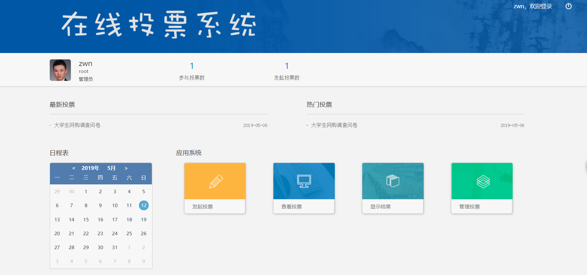
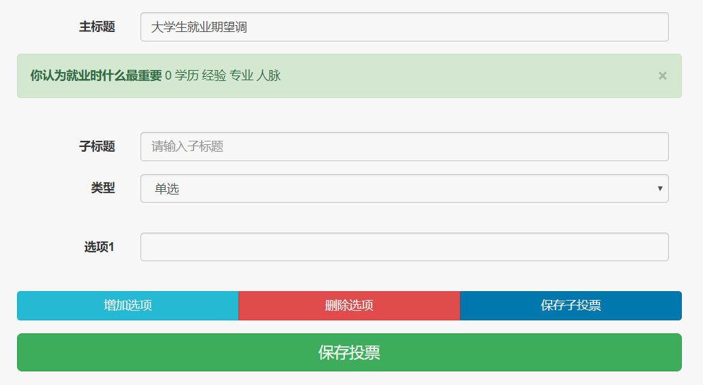
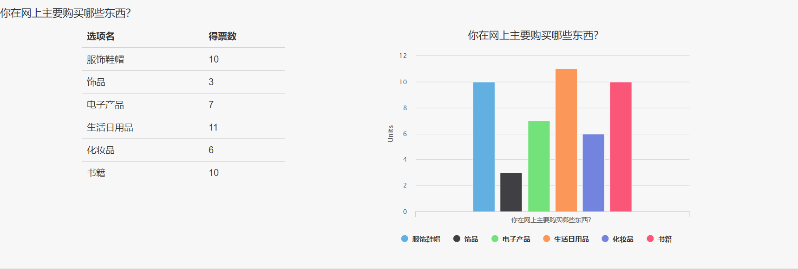
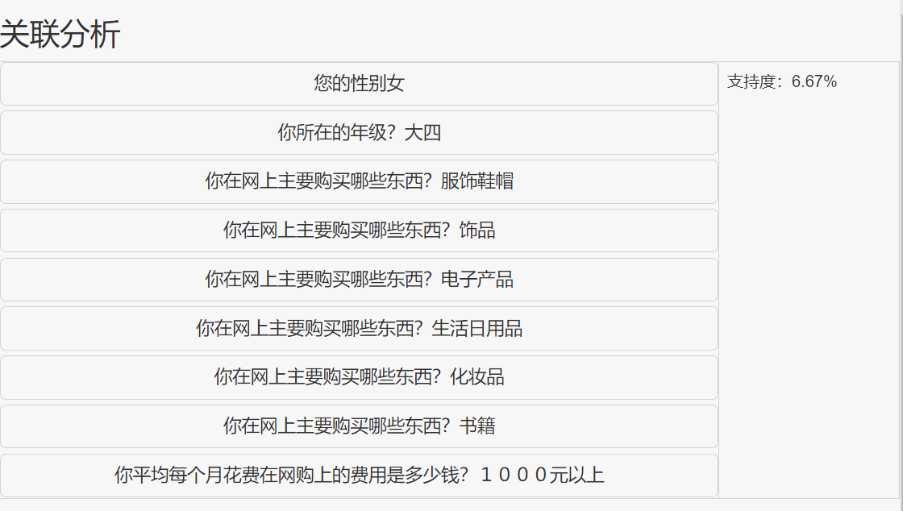
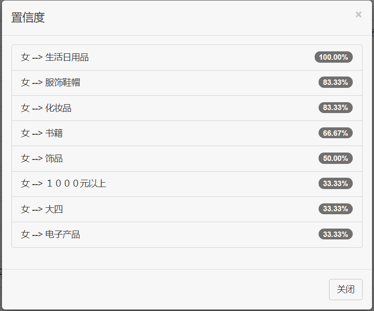
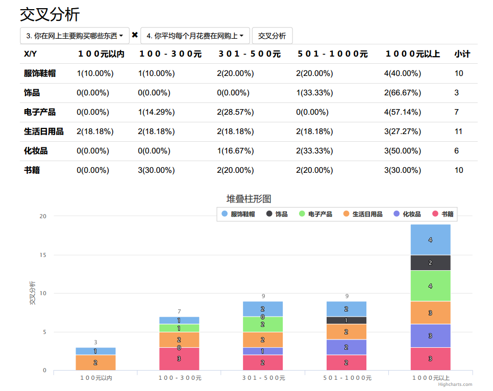
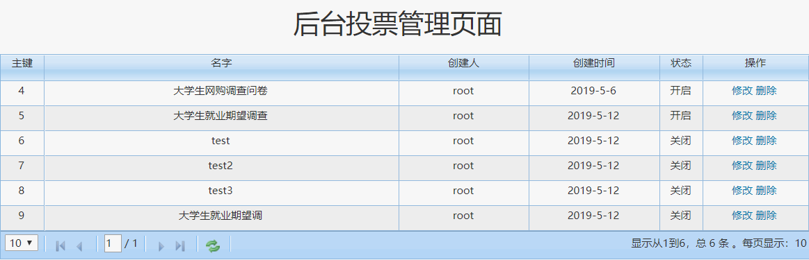

# 基于SSH框架的在线投票系统

毕业设计项目为基于Spring、Spring MVC、Hibernate的在线投票系统，包括创建投票、查看投票、结果分析等功能。数据库使用MySQL数据库，样式方面使用Bootstrap框架，后台使用拦截器进行权限管理并使用ThreadLocal类进行多线程处理，在结果分析方面使用数据挖掘的Apriori算法，利用Highcharts插件展示柱形图。

## 系统界面截图
### 首页

### 创建投票页面

### 投票数统计

### 关联分析

### 交叉分析

### 管理页面

